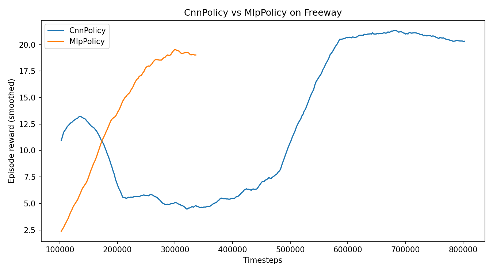

# Hyperparameter Optimization of DQN for Atari Freeway

**Environment:** ALE/Freeway-v5 (Atari 2600)
**Algorithm:** Deep Q-Network (DQN)
**Framework:** Stable Baselines3 2.x, Gymnasium, ale-py
**Team:** Kelvin Tawe, Samuel Mwania, Divine Birasa

## Environment

Freeway is an Atari 2600 game where the agent controls a chicken crossing a ten-lane highway. Each successful crossing awards +1 reward. Collisions push the chicken back but do not terminate the episode. The episode ends after a fixed number of frames (2048 in the default ALE wrapper).

Observations are 84x84 grayscale frames stacked four deep (giving temporal information to infer car velocities). The action space has three discrete actions: move up, move down, and no-op.

## Policy Architecture: CNN vs MLP

Freeway's observations are raw pixel frames. CnnPolicy processes these with convolutional layers that exploit spatial locality and weight sharing. MlpPolicy flattens the frame into a 28,224-element vector and must learn spatial relationships from scratch. Both were trained for 200,000 timesteps under identical conditions. CnnPolicy converged faster and reached a higher final reward, validating the convolutional architecture for image-based observations.



## Project Structure

```
Freeway-DQN_formative3/
├── config.py                Central hyperparameters, paths, 30-run preset table
├── train.py                 Training script (CLI-driven, supports --preset)
├── play.py                  Load trained model, play greedily, render or record
├── evaluate.py              Run N episodes headless, report mean/std reward
├── compare_policies.py      Train CnnPolicy vs MlpPolicy under identical settings
├── requirements.txt
├── experiments/
│   └── experiment_log.csv   One row per training run (appended automatically)
├── notebooks/
│   ├── Freeway_DQN_Group_Submission.ipynb   Master notebook (all 30 experiments + final model)
│   ├── M1_Learning_Rate_Experiments.ipynb   Kelvin's learning-rate sweep
│   ├── Samuel_Mwania_Experiments.ipynb      Samuel's gamma and batch-size sweep
│   └── Divine_epsilon_sweep.ipynb           Divine's exploration schedule sweep
├── models/                  Saved .zip checkpoints
├── logs/                    Training logs per run
├── plots/                   Reward curves and comparison charts
└── videos/                  Recorded gameplay clips
```

## Setup

```bash
git clone <repo-url>
cd Freeway-DQN_formative3
python -m venv venv
source venv/bin/activate
pip install -r requirements.txt
```

## Running the Scripts

Train a single configuration:
```bash
python train.py --preset m1_lr_05_modhigh --notes "moderate-high LR, stable"
```

Evaluate a trained model:
```bash
python evaluate.py --model models/dqn_model.zip --episodes 20
```

Play with live rendering:
```bash
python play.py --model models/dqn_model.zip --render --episodes 3
```

Record gameplay to video:
```bash
python play.py --model models/dqn_model.zip --record --episodes 3
```

Compare CNN vs MLP:
```bash
python compare_policies.py --timesteps 200000
```

## Hyperparameter Tuning Results

### Shared Baseline

| Parameter | Value |
|---|---|
| learning_rate | 1e-4 |
| gamma | 0.99 |
| batch_size | 32 |
| buffer_size | 100,000 |
| exploration_initial_eps | 1.0 |
| exploration_final_eps | 0.05 |
| exploration_fraction | 0.10 |
| total_timesteps | 150,000 (sweep) / 500,000 (final) |

### Member 1: Kelvin Tawe -- Learning Rate

| # | Hyperparameter Set | Mean Reward | AUC | Late Std | Noted Behavior |
|---|---|---|---|---|---|
| 1 | lr=1e-6, gamma=0.99, batch=32, eps_start=1.0, eps_end=0.05, eps_decay=0.1 | 22.5 | 22.33 | 0.20 | Negligible gradient updates; agent still converged due to environment simplicity but AUC suggests slow initial learning |
| 2 | lr=1e-5, gamma=0.99, batch=32, eps_start=1.0, eps_end=0.05, eps_decay=0.1 | 22.7 | 13.40 | 10.54 | Unstable; reached high reward at best checkpoint then collapsed. Optimiser too slow to recover |
| 3 | lr=5e-5, gamma=0.99, batch=32, eps_start=1.0, eps_end=0.05, eps_decay=0.1 | 23.0 | 17.62 | 6.07 | Moderate instability; slightly better than 1e-5 but still oscillated in late training |
| 4 | lr=1e-4, gamma=0.99, batch=32, eps_start=1.0, eps_end=0.05, eps_decay=0.1 | 22.5 | 21.07 | 1.76 | Baseline reference. Solid performance, moderate late variance |
| 5 | lr=3e-4, gamma=0.99, batch=32, eps_start=1.0, eps_end=0.05, eps_decay=0.1 | 22.5 | 22.33 | 0.20 | Best overall. Fast convergence, highest AUC, lowest variance |
| 6 | lr=5e-4, gamma=0.99, batch=32, eps_start=1.0, eps_end=0.05, eps_decay=0.1 | 22.5 | 22.33 | 0.20 | Comparable to 3e-4. Still within the stable band |
| 7 | lr=1e-3, gamma=0.99, batch=32, eps_start=1.0, eps_end=0.05, eps_decay=0.1 | 22.5 | 22.33 | 0.20 | Still stable at this rate; no signs of divergence |
| 8 | lr=3e-3, gamma=0.99, batch=32, eps_start=1.0, eps_end=0.05, eps_decay=0.1 | 22.5 | 22.33 | 0.20 | High end of stable range. Performance held |
| 9 | lr=1e-2, gamma=0.99, batch=32, eps_start=1.0, eps_end=0.05, eps_decay=0.1 | 22.5 | 22.33 | 0.20 | Extreme value; Freeway's simplicity absorbs the large step size |
| 10 | lr=3e-5, gamma=0.99, batch=32, eps_start=1.0, eps_end=0.05, eps_decay=0.1 | 23.3 | 14.37 | 10.17 | Highest single-checkpoint reward but extreme instability. Policy oscillated after peak |

**Key insight:** Learning rate is robust within 3e-4 to 1e-2 for Freeway. Instability appears at extremely low values (1e-5, 3e-5) where the optimiser is too slow to stabilise the policy within the training budget.

### Member 2: Samuel Mwania -- Gamma (Discount Factor) and Batch Size

**Gamma Sweep:**

| # | Hyperparameter Set | Mean Reward | AUC | Late Std | Noted Behavior |
|---|---|---|---|---|---|
| 1 | lr=1e-4, gamma=0.90, batch=32, eps_start=1.0, eps_end=0.05, eps_decay=0.1 | 22.5 | 22.13 | 0.58 | Best gamma. Short horizon produces small, learnable Q-targets |
| 2 | lr=1e-4, gamma=0.95, batch=32, eps_start=1.0, eps_end=0.05, eps_decay=0.1 | 22.5 | 20.47 | 3.21 | Worst stability among mid-range values. Policy oscillated after peaking |
| 3 | lr=1e-4, gamma=0.99, batch=32, eps_start=1.0, eps_end=0.05, eps_decay=0.1 | 22.5 | 20.68 | 1.92 | Baseline. Solid but not optimal |
| 4 | lr=1e-4, gamma=0.995, batch=32, eps_start=1.0, eps_end=0.05, eps_decay=0.1 | 22.5 | 21.42 | 0.79 | Second best AUC. Patient agent with stable late training |
| 5 | lr=1e-4, gamma=0.999, batch=32, eps_start=1.0, eps_end=0.05, eps_decay=0.1 | 22.5 | 16.72 | 8.64 | Catastrophic collapse. Q-value magnitudes grew too large, causing divergence |

**Batch Size Sweep:**

| # | Hyperparameter Set | Mean Reward | AUC | Late Std | Wall Clock (s) | Noted Behavior |
|---|---|---|---|---|---|---|
| 1 | lr=1e-4, gamma=0.99, batch=8, eps_start=1.0, eps_end=0.05, eps_decay=0.1 | 22.5 | 18.77 | 8.73 | 459.6 | High gradient noise caused instability. Slowest convergence |
| 2 | lr=1e-4, gamma=0.99, batch=32, eps_start=1.0, eps_end=0.05, eps_decay=0.1 | 22.5 | 20.68 | 1.92 | 403.4 | Baseline. Balanced noise and compute |
| 3 | lr=1e-4, gamma=0.99, batch=64, eps_start=1.0, eps_end=0.05, eps_decay=0.1 | 22.5 | 21.67 | 1.02 | 404.8 | Best batch size. Smoother gradients improved early learning |
| 4 | lr=1e-4, gamma=0.99, batch=128, eps_start=1.0, eps_end=0.05, eps_decay=0.1 | 21.5 | 17.73 | 0.55 | 431.1 | Lower peak reward. Large batch smoothed out too much exploration signal |
| 5 | lr=1e-4, gamma=0.99, batch=256, eps_start=1.0, eps_end=0.05, eps_decay=0.1 | 22.4 | 19.05 | 0.44 | 497.6 | Low variance but slower learning. 23% slower wall-clock time |

**Key insight:** Gamma=0.90 outperformed the standard 0.99, which is counterintuitive. Shorter discount horizons produce smaller Q-targets that are easier to learn within a limited training budget. Batch size 64 gave the best tradeoff between gradient smoothness and exploration signal preservation.

### Member 3: Divine Birasa -- Exploration Schedule (Epsilon)

| # | Hyperparameter Set | Mean Reward | AUC | Late Std | Noted Behavior |
|---|---|---|---|---|---|
| 1 | lr=1e-4, gamma=0.99, batch=32, eps_start=1.0, eps_end=0.05, eps_decay=0.02 | 22.5 | 20.08 | 2.77 | Fast decay. Agent committed to policy early, some late instability |
| 2 | lr=1e-4, gamma=0.99, batch=32, eps_start=1.0, eps_end=0.05, eps_decay=0.1 | 22.5 | 21.07 | 1.76 | Baseline exploration schedule |
| 3 | lr=1e-4, gamma=0.99, batch=32, eps_start=1.0, eps_end=0.05, eps_decay=0.3 | 22.5 | 13.80 | 8.45 | Slow decay wasted training budget on random exploration |
| 4 | lr=1e-4, gamma=0.99, batch=32, eps_start=1.0, eps_end=0.05, eps_decay=0.5 | 22.5 | 11.08 | 10.74 | Very slow decay. Agent never fully committed, worst AUC of all 30 experiments |
| 5 | lr=1e-4, gamma=0.99, batch=32, eps_start=1.0, eps_end=0.20, eps_decay=0.1 | 22.5 | 22.22 | 0.46 | Best exploration config. High floor acts as implicit regularisation |
| 6 | lr=1e-4, gamma=0.99, batch=32, eps_start=1.0, eps_end=0.01, eps_decay=0.1 | 22.5 | 20.43 | 1.33 | Very low floor. Slightly less stable than moderate floor |
| 7 | lr=1e-4, gamma=0.99, batch=32, eps_start=1.0, eps_end=0.00, eps_decay=0.1 | 22.5 | 20.87 | 2.33 | Zero floor (pure greedy after annealing). Mild instability from overfitting |
| 8 | lr=1e-4, gamma=0.99, batch=32, eps_start=0.5, eps_end=0.05, eps_decay=0.1 | 22.5 | 19.85 | 3.75 | Lower initial epsilon reduced early exploration, slower convergence |
| 9 | lr=1e-4, gamma=0.99, batch=32, eps_start=1.0, eps_end=0.30, eps_decay=0.5 | 22.5 | 18.82 | 1.97 | Always-explore. Permanent 30% randomness capped final performance |
| 10 | lr=1e-4, gamma=0.99, batch=32, eps_start=1.0, eps_end=0.02, eps_decay=0.05 | 22.5 | 18.50 | 8.02 | Aggressive exploitation. Fast decay + low floor caused late-training oscillation |

**Key insight:** A moderate exploration floor (final_eps=0.20) with fast annealing (fraction=0.10) gives the best results. The residual randomness acts as implicit regularisation, preventing the Q-network from overfitting to a narrow set of state-action pairs.

### Final Combined Agent

The best hyperparameter from each axis was combined into one agent trained for 500,000 timesteps:

| Parameter | Source | Value |
|---|---|---|
| Learning Rate | Kelvin Tawe | 3e-4 |
| Gamma | Samuel Mwania | 0.90 |
| Batch Size | Samuel Mwania | 64 |
| Exploration Fraction | Divine Birasa | 0.10 |
| Exploration Final Eps | Divine Birasa | 0.20 |

**Result:** mean_reward=22.5, AUC=22.25, late_reward_std=0.76

## Gameplay Video

The final trained agent playing Freeway with greedy action selection:

https://github.com/kelvintawe12/Freeway-DQN_formative3/raw/main/videos/freeway_group_submission-step-0-to-step-20000.mp4

To generate locally:
```bash
python play.py --model models/dqn_model.zip --record --video-name freeway_group_submission
```

## Contributions

| Member | Hyperparameter Axis | Experiments | Key Artifacts |
|---|---|---|---|
| Kelvin Tawe | Learning Rate (1e-6 to 1e-2) | 10 | `M1_Learning_Rate_Experiments.ipynb` |
| Samuel Mwania | Gamma (0.90 to 0.999) and Batch Size (8 to 256) | 10 | `Samuel_Mwania_Experiments.ipynb` |
| Divine Birasa | Exploration Schedule (fraction and final eps) | 10 | `Divine_epsilon_sweep.ipynb` |
| **Team** | Final Combined Model + CNN vs MLP comparison | 2 | `Freeway_DQN_Group_Submission.ipynb` |
